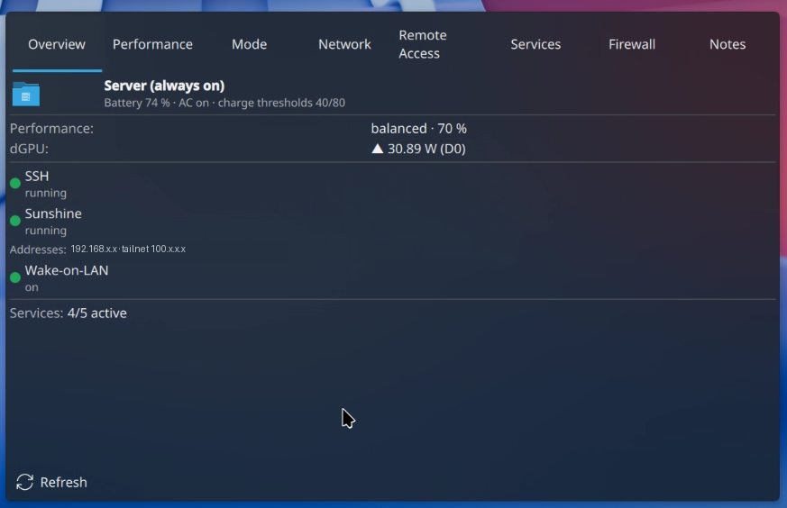

# Mobile AI Server Switch

**A KDE Plasma 6 widget to monitor and control a workstation/laptop that's
temporarily running as a server** — mode, performance/power, remote access,
services and firewall, all visible at a glance and controllable from your
phone over your Tailnet.

[](LICENSE)
[](https://kde.org/plasma-desktop/)
[](plasmoid/io.github.sunsetterphoto.mobileserverswitch/metadata.json)

## Why

Laptops/workstations sometimes double as a server for a while — a
remote-desktop host for game streaming, a compute box, a media or dev
server — and then go back to being a normal laptop. Mobile AI Server Switch
started as a simple server/laptop toggle and grew into a **comprehensive
control and status center**: mode, performance/power, remote access,
services and firewall, all controllable remotely over your Tailnet — from
your phone, without needing a terminal.

## Screenshots



The **Overview** tab: operating mode and battery, the performance profile and
what the discrete GPU is drawing, remote-access indicators, the machine's
addresses, and how many services are up — everything at a glance, with each
section clicking through to its own tab. Addresses are redacted in this
capture.

> 📸 The remaining tabs — **Performance**, **Mode**, **Network**, **Remote
> Access**, **Services**, **Firewall** and **Notes** — plus the in-widget
> settings dialog will be captured next.

<!-- Screenshot layout to restore once the remaining docs/img/*.png exist:
| Overview | Performance | Mode |
|---|---|---|
|  |  |  |
| Network | Remote Access | Services |
|  |  |  |
| Firewall | Notes | Settings |
|  |  |  |
-->


## Features

| Tab | What it shows / does |
|---|---|
| **Overview** | Compact read-only summary: mode, performance preset, dGPU power draw, battery/AC, Tailnet IP, SSH/remote-desktop status, active services, Wake-on-LAN. Sections jump to their detail tab on click. |
| **Performance** | Three presets (power saver / balanced / performance) via KDE's PowerProfiles (`org.freedesktop.UPower.PowerProfiles`) plus a fine CPU-cap slider (`intel_pstate/max_perf_pct`, 16-100%, turbo on/off). Also: dGPU runtime power management and the WiFi/Bluetooth radios. |
| **Mode** | Server ⇄ Laptop switch. Server mode favors uninterrupted uptime (screen lock/suspend behavior, charging, background services); switching back to Laptop stops the configured server services and asks for confirmation first. |
| **Network** | How the machine is reachable right now: hostname, which interface carries the default route and via which gateway, the active DNS resolvers, and every interface with its IPv4/IPv6 addresses (selectable, so they can be copied). Virtual interfaces sort last and are labelled as such, so a bridge is not mistaken for a way in. |
| **Remote Access** | Status and details for SSH, RDP (KRDP), VNC, Sunshine, KDE Connect, Tailnet (copyable IP), Wake-on-LAN. On/off switches for RDP and Sunshine; **SSH and Tailscale are deliberately read-only** (lockout protection). |
| **Services** | A configurable list of user/system services (systemd) with live status, port reachability, and start/stop. |
| **Firewall** | firewalld status (zone, LAN interfaces, open ports, SSH always shown allowed) plus targeted LAN-only blocks for configured apps (e.g. RDP/VNC). Tailnet access is never affected by these blocks. |
| **Notes** | A scratchpad for what matters about this machine, stored as a plain file (`~/.config/mobileserverswitch/notes.md`, mode 600) so it stays editable over SSH with any editor. Saves are debounced; if the file changed outside the widget, an automatic save is suppressed and you are asked instead — an automatic action never overwrites someone else's edit. |

## Requirements & compatibility

- **KDE Plasma 6, Wayland.** Built and tested against Plasma 6.7.
- **`jq`** and **`kpackagetool6`** are required (installer checks for both).
- Everything else is **optional, with graceful degradation** — the widget
  hides what your system doesn't have instead of erroring:
  - `firewalld` → Firewall tab (hidden if absent)
  - `rfkill` → WiFi/Bluetooth switches
  - `ethtool` → Wake-on-LAN status/control
  - `tailscale` → Tailnet IP/status, RDP tailnet-only bind
  - PowerProfiles D-Bus / `intel_pstate` → performance presets/CPU cap
  - `nvidia-smi` → dGPU power-draw reporting
- **Distro-agnostic** by design: nothing is hardcoded to a specific distro;
  the installer probes for the tools above rather than assuming a package
  manager.

## Install

### Quick

```bash
git clone https://github.com/sunsetterphoto/MobileAIServerSwitch.git
cd MobileAIServerSwitch
./install.sh
```

`install.sh` is idempotent (safe to re-run), checks dependencies, and
installs:

- the plasmoid via `kpackagetool6 --install`,
- the CLIs (`bin/*`) to `~/.local/bin`,
- the privileged helpers (`system/usr-local-sbin/*`) to `/usr/local/sbin`
  (root, via `sudo`),
- a default config at `~/.config/mobileserverswitch/config.json`,
- optionally, a scoped `/etc/sudoers.d/mobileserverswitch` grant (asks for
  explicit consent first; skip with `--no-sudoers`).

Preview everything it would do with `./install.sh --dry-run`. Reload the
plasmoid after install/upgrade: `kquitapp6 plasmashell && kstart plasmashell`.
Reverse with `./uninstall.sh` (add `--purge` to also remove your config).

### Manual

```bash
kpackagetool6 --type Plasma/Applet --install plasmoid/io.github.sunsetterphoto.mobileserverswitch
install -D -m 755 bin/msw-*      -t ~/.local/bin/
sudo install -D -m 755 system/usr-local-sbin/msw-*-apply -t /usr/local/sbin/
```

Then add the widget to a panel or the desktop as usual ("Add Widgets" →
"Mobile AI Server Switch").

## Configuration

Three layers, in order of precedence:

1. **Auto-detection** at runtime (default) — LAN interfaces from the default
   route, Tailscale presence/IP, firewalld's default zone, the
   Wake-on-LAN NIC — so the widget works out of the box with no config file.
2. **Config file**, `~/.config/mobileserverswitch/config.json` — override
   only what auto-detection gets wrong, define your services list, firewall
   app whitelist, mode behavior, etc. See
   [`config/config.example.json`](config/config.example.json) for the full
   schema with commented-out examples (Sunshine, Jellyfin, Ollama,
   Syncthing, ...).
3. **In-widget settings** (Plasma's own configuration dialog) — the same
   values, editable without touching a file; the widget writes them back to
   the config file so the CLIs and the GUI always agree.

Any key you omit falls back to its default — usually `"auto"`.

## Architecture

The plasmoid is **pure GUI**. All logic lives in small, single-purpose CLIs
(the single source of truth); the widget only reads `msw-status --json` and
calls the matching CLI for actions. This guarantees the widget, an SSH
session, and any boot-time unit always agree on state.

```
┌─────────────────────────────┐        reads         ┌───────────────────┐
│  Plasmoid (QML) — 8 tabs    │ ───────────────────▶  │  msw-status --json │
│  pure GUI, no logic          │                       └───────────────────┘
└─────────────────────────────┘                                │
              │ calls (actions)                                 │ aggregates
              ▼                                                  ▼
┌─────────────────────────────┐        sudo -n        ┌───────────────────┐
│  msw-mode / msw-perf /       │ ───────────────────▶  │  msw-*-apply       │
│  msw-power / msw-firewall    │   (scoped sudoers,     │  (root, fixed       │
│  msw-krdp-setup               │    fixed whitelist)    │  whitelist)         │
└─────────────────────────────┘                        └───────────────────┘
```

```
plasmoid/io.github.sunsetterphoto.mobileserverswitch/   Plasma applet (QML) — pure GUI, 8 tabs
bin/msw-status                state aggregator -> JSON (the widget interface)
bin/msw-mode                  server/laptop switch (PowerDevil, locker, services, charging)
bin/msw-perf                  performance: 3 presets (D-Bus PowerProfiles) + fine CPU cap
bin/msw-power                 power switches: dGPU / WiFi / Bluetooth / EPP / WoL
bin/msw-firewall              LAN blocks per app (firewalld, single zone)
bin/msw-krdp-setup            generates the KRDP live override from a template (password stays local)
bin/msw-config                shared config-reader + auto-detection helpers (sourced, not run directly)
system/usr-local-sbin/        privileged helpers: msw-charge-apply / -perf-apply / -power-apply / -firewall-apply (fixed whitelists)
system/systemd/               msw-charge-thresholds.service (charge thresholds at boot, opt-in)
system/systemd-user/          KRDP override template (Tailnet bind; no password in the repo)
packaging/                    sudoers template, installed only with explicit consent
docs/KRDP.md                  KRDP (Wayland RDP) setup, verified
tests/                        shell test suites (sync, status JSON, perf/power/firewall, install)
scripts/sync.sh                syncs repo -> system (copy-only, idempotent, --dry-run)
install.sh / uninstall.sh     installer / uninstaller
```

## Security model

- **SSH and Tailscale/the Tailnet are never switched or firewalled** — no
  button, no rule, anywhere in the codebase. The firewall helper only knows
  a fixed/configured app whitelist and carries a defense-in-depth guard that
  refuses any rule touching port 22 (fail closed), regardless of config.
- **RDP (KRDP)** is bound **exclusively to the Tailnet**, never `0.0.0.0`,
  Wayland-native via `--plasma`. If no Tailnet address can be detected, RDP
  setup refuses to run at all rather than falling back to a wider bind.
  Details + reproduction: [`docs/KRDP.md`](docs/KRDP.md). Passwords never
  live in the repo (only a sanitized override template + a setup helper that
  fills it in locally).
- **Reads are unprivileged.** Writes to system state (sysfs, rfkill,
  ethtool, firewalld) go exclusively through dedicated `msw-*-apply` helpers
  under `/usr/local/sbin`, each enforcing a fixed whitelist — never a
  blanket `sudo` from the widget. The one exception is the Services tab,
  which starts/stops selected services directly via
  `sudo -n systemctl start|stop <unit>`, where `<unit>` always comes from
  your configured services list (never free-form input).
- Risky live actions (CPU cap, service start/stop, radio switches, firewall
  rules) are all reversible and never change remote reachability.

## Uninstall

```bash
./uninstall.sh            # keeps your config
./uninstall.sh --purge    # also removes ~/.config/mobileserverswitch/
```

## Contributing

See [`CONTRIBUTING.md`](CONTRIBUTING.md) for the dev loop, coding
conventions and how to run the test suite.

## License

MIT © sunsetterphoto — see [`LICENSE`](LICENSE).
